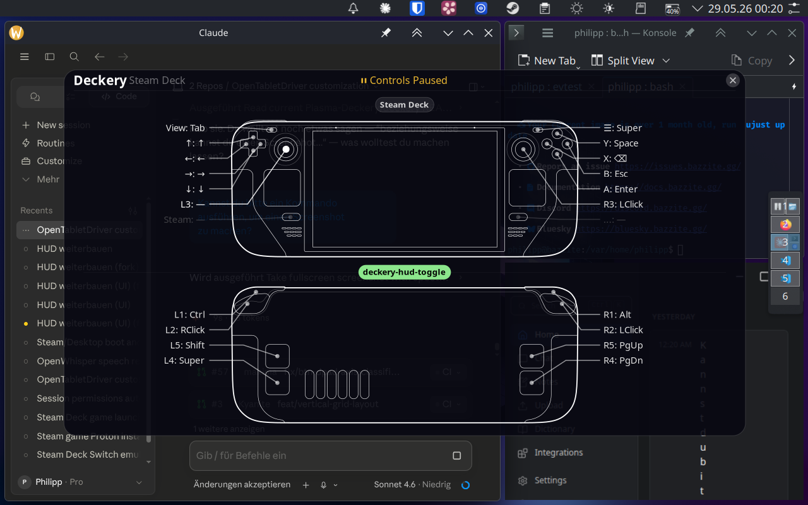

# Deckery

**Making the Steam Deck a fast, productive handheld — independent of Steam.**

Deckery replaces Steam Input with a direct evdev-based remapping stack that runs in any desktop session, no Steam process required. The goal is to make full use of the Steam Deck's input hardware — trackpads, back paddles, touch, and all buttons — and to put context-aware controls within instant reach without memorising config files.

The **HUD** is the central interface: a transparent overlay that shows your current button mappings live, updating in real time as you hold modifiers or switch contexts.

---

## HUD



The HUD overlays a transparent Steam Deck diagram with live button labels. It updates instantly when a modifier is held or released. No focus, no interaction — just information. Per-app layout switching is planned for a future release.

---

## What it does

### Remapping

| Feature | Tool | Status |
|---|---|---|
| Steam-independent button remapping | [makima-deckery](https://github.com/Plasma-Deckery/makima-deckery) | ✅ Working |
| D-Pad, back paddles, all buttons | makima-deckery | ✅ Working |
| Right stick → cursor | makima-deckery | ✅ Working |
| Per-app button layouts | makima-deckery + kdotool | 📋 Planned |
| Config inheritance (`EXTENDS =`) | makima-deckery | 📋 Planned |

### HUD

| Feature | Tool | Status |
|---|---|---|
| Steam Deck diagram overlay | deckery-hud | 🔧 In Progress |
| Live button labels | deckery-hud | 🔧 In Progress |
| Modifier overlay (live shortcut view) | deckery-hud | 🔧 In Progress |
| Per-app context switching | deckery-hud | 📋 Planned |

### Radial menus

| Feature | Tool | Status |
|---|---|---|
| Context-aware radial menus | [Kando](https://github.com/kando-menu/kando) | 📋 Planned |

---

## Architecture

```
Steam Deck hardware
    │
    ├─ HHD (virtual Xbox device) ──────────────► Kando (radial menus)
    │
    └─ /dev/input/event* (evdev)
           │
           └─ makima-deckery ──────────────────► virtual keyboard/mouse device
                   │                                    │
                   ├─ /tmp/makima-state.json             └─► KDE / apps
                   └─ /tmp/makima.sock (IPC)
                           │
                           └─ deckery-hud
```

**makima-deckery** reads raw controller events, applies the config, emits keyboard/mouse events, and writes a fully-resolved state snapshot for the HUD. No Steam Input in the loop.

---

## Repos

| Repo | Description |
|---|---|
| [Plasma-Deckery/deckery](https://github.com/Plasma-Deckery/deckery) | This repo — configs, docs, patches |
| [Plasma-Deckery/makima-deckery](https://github.com/Plasma-Deckery/makima-deckery) | Patched makima fork with state export + IPC |
| [Plasma-Deckery/deckery-hud](https://github.com/Plasma-Deckery/deckery-hud) | HUD overlay |
| [Plasma-Deckery/steamdeck-dotfiles](https://github.com/Plasma-Deckery/steamdeck-dotfiles) | System dotfiles |

---

## Upstream contributions

| Project | PR | Description |
|---|---|---|
| cyber-sushi/makima | [#57](https://github.com/cyber-sushi/makima/pull/57) | Fix BTN_DPAD_* silently ignored in config |
| cyber-sushi/makima | [#58](https://github.com/cyber-sushi/makima/pull/58) | Fix x11rb::connect panic after suspend |
| emberian/evdev | [#178](https://github.com/emberian/evdev/pull/178) | Add BTN_GRIPL/R/L2/R2 keycodes for Steam Deck back paddles |
| MurderFromMars/Kyanite | [#3](https://github.com/MurderFromMars/Kyanite/pull/3) | Vertical grid layout for single-column workspace switching |

---

## Device

Tested on: Steam Deck (Bazzite, KDE Plasma 6, Wayland)
Should work on: any handheld Linux device running HHD
