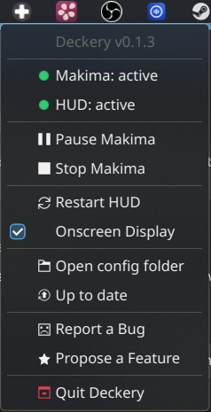

# deckery-tray

**Repository:** [Plasma-Deckery/deckery](https://github.com/Plasma-Deckery/deckery) (bundled in the main repo, under `tray/`)

System tray applet that monitors and controls the full Deckery stack from a single icon in the KDE panel.



## What it does

- **Service status** — live display of the running state of makima and the HUD in the tray menu
- **Pause / Resume** — sends `pause` / `resume` over the makima IPC socket without restarting the service
- **Restart / Start / Stop** — controls makima and deckery-hud via systemd user units
- **Controller Bindings** — submenu listing all known configs with live status; app-specific configs can be toggled on/off with a checkbox; error configs show a red indicator that opens a scrollable error dialog on click
- **Updates** — "Search for Updates" entry pulls all repos and re-runs the installer
- **Config folder** — opens `~/.config/deckery/` in the file manager for quick access
- **Steam Input** — shows whether Steam's Desktop Input is disabled (green) or still active (yellow); clicking the yellow indicator opens a terminal that writes the configset entry and optionally restarts Steam
- **Tooltip** — always shows "Deckery" on hover for quick identification

## Tray icon states

| Icon | Condition |
|---|---|
| 🟢 Green | All services active, no errors |
| 🟡 Amber | Any service not fully active; makima paused; makima reinitialising after device reconnect/resume (`lifecycle: "starting"` or `"reinitialising"`); Steam Input still active |
| 🔴 Red | Any service failed; no device found (`errors.no_device`); base config parse error (`errors.base_config`) |
| 🎮 Gaming | Gaming Mode active (overrides amber) |

## Architecture

Built with GTK3 + AyatanaAppIndicator3. Runs inside the `deckery` distrobox container, launched via the `deckery-tray-launch` wrapper script.

**Service hierarchy:**

```
plasma-core.target  ← KDE-only, not active in Gamescope/Gaming Mode
    └── deckery-tray.service  ← owns the distrobox container, starts on login
            ├── makima.service       (BindsTo tray — cannot run without it)
            └── deckery-hud.service  (BindsTo tray — cannot run without it)
```

`deckery-tray.service` is bound to `plasma-core.target` (a KDE-specific systemd target that is not active in Gamescope/Gaming Mode). An `ExecCondition` guard additionally confirms that `plasma-plasmashell.service` is running before the tray starts — if the check fails, the service is skipped cleanly without triggering a restart loop. This means Deckery does not start in Gaming Mode and does not interfere with Gamescope.

`deckery-tray.service` runs `podman start deckery` before launching the tray, ensuring the container's main `conmon` process always lands in the tray's cgroup. This makes the tray the true owner of the container — stopping the tray stops everything cleanly.

**State tracking:**

| Source | Used for |
|---|---|
| `systemctl --user is-active` | Running state of makima and deckery-hud |
| `/tmp/makima-state.json` | `paused`, `lifecycle`, `errors`, `configs` |
| `/tmp/makima-control.sock` | Sending IPC commands (pause / resume / config enable / disable) |
| `configset_controller_neptune.vdf` | Steam Input configured state (polled every 2 s) |

Status updates run on a background thread to keep the GTK main loop responsive. A `Gio.FileMonitor` on `makima-state.json` triggers an immediate debounced refresh (120 ms window) whenever the file changes — pause state changes appear in the menu within milliseconds.

**Controller Bindings submenu (`config_menu.py`):**

The submenu is managed by a dedicated `ConfigSubmenu` class in `tray/config_menu.py`. It holds one permanent slot per config name (a `CheckMenuItem`/`MenuItem` pair). Slots are created at startup from the initial `state.json` read; if a new config appears at runtime a slot is appended live. Slots are never destroyed — they are hidden when their config is absent.

Live updates work via dbusmenu property propagation: label, active state, and visibility changes always reach the panel. Structural additions use `append()` (not `insert()`) because dbusmenu only propagates `append()` to already-cached submenus.

## Related

- [makima-deckery](makima-deckery/index.md) — produces the state JSON and IPC socket
- [deckery-hud](deckery-hud.md) — managed by the tray as a dependent service
