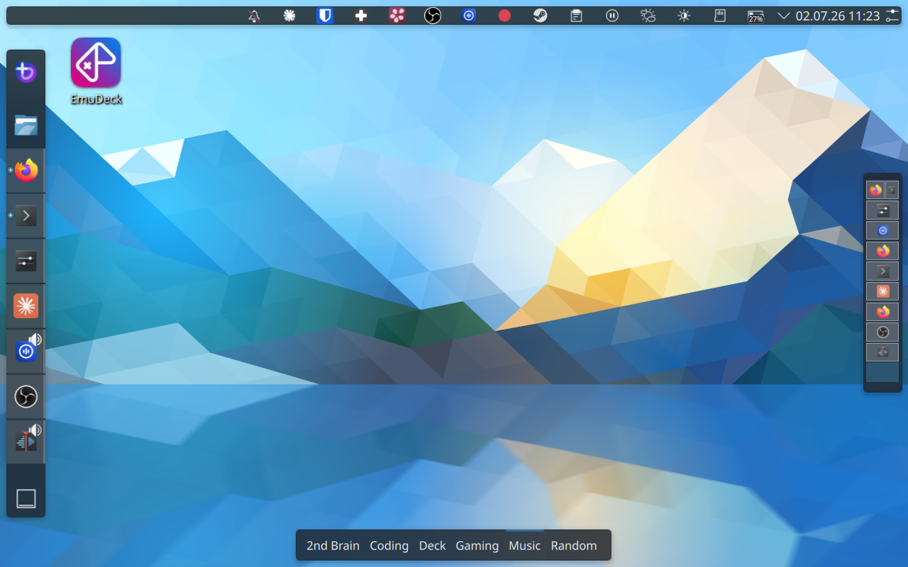

# Steam Deck Dotfiles

**Repository:** [Plasma-Deckery/steamdeck-dotfiles](https://github.com/Plasma-Deckery/steamdeck-dotfiles)

An opinionated KDE Plasma desktop setup tuned for the Steam Deck's screen size and input methods. Managed via [chezmoi](https://www.chezmoi.io/).

The goal is a desktop that works well with a controller and no keyboard — clean, fast to navigate, and organised so you always know where things are.

## Layout

The panel layout is built around the Steam Deck's portrait-friendly screen:

- **Dock** on the left — app launcher and pinned applications
- **Desktop switcher** on the right — vertical spaces, always visible
- **Taskbar** at the top — system tray, clock, status icons
- **Activity bar** at the bottom — switch between named activity contexts



## Activities and workspaces

KDE Activities act as separate desktops with their own sets of virtual spaces. Each activity has a dedicated purpose — Coding, Gaming, Music, 2nd-Brain, Deck, Random — so apps for different contexts never mix.

Within each activity, each virtual desktop holds at most one or two applications. Apps open in tiling mode and automatically fill the available space, so there is never a need to move or resize windows manually.

<video src="../../assets/tiling.mp4" controls autoplay loop muted></video>

## Window tiling

[Kröhnkite](../krohnkite.md) provides dynamic window tiling — windows automatically arrange to fill the available space without manual resizing. [maximized-window-gaps](../maximized-window-gaps.md) adds configurable gaps around tiled windows so the layout breathes a little on the small screen.

Both are KWin scripts, installable with a single `kpackagetool6` call — making them straightforward to automate.

## Dynamic workspace management

A KWin script ([Kyanite](../kyanite.md)) ensures there is always exactly one free desktop available at the end of the list. When you close the last app on a space, that space is cleaned up automatically. When all spaces are occupied, a new one is created. Workspace management is fully automatic — you never have to create or delete desktops manually.

<video src="../../assets/desktopswitch.mp4" controls autoplay loop muted></video>

## Focus follows mouse

The pointer focus policy is set so that moving the cursor to a window focuses it immediately, without clicking. On a small screen with a trackpad, this removes a significant source of friction.

```bash
kwriteconfig6 --file kwinrc --group Windows --key FocusPolicy FocusFollowsMouse
qdbus6 org.kde.KWin /KWin reconfigure
```

## Focus stealing prevention

KWin's focus stealing prevention is set to Medium. Without this, the Steam on-screen keyboard grabs focus away from the app you're typing into — so keystrokes land in the keyboard window rather than the input field. Medium prevents this while still allowing legitimate focus changes.

```bash
kwriteconfig6 --file kwinrc --group Windows --key FocusStealing 1
qdbus6 org.kde.KWin /KWin reconfigure
```

## Window rules

A single KWin rule keeps Firefox Picture-in-Picture windows always on top across all activities and desktops. Without this, PiP windows disappear behind other windows whenever focus changes — on a small screen that means they're effectively lost.

## Voice input

A [RNNoise](https://github.com/xiph/rnnoise) PipeWire filter-chain is configured for noise suppression during voice input. This is particularly useful outdoors. The config file lives in `~/.config/pipewire/filter-chain.conf.d/` — a single file copy and a PipeWire restart is all that's needed to apply it.

Works together with [OpenWhispr](../openwhispr.md) for hotkey-activated speech-to-text.

## Scriptability

Most of this setup can be applied automatically. The table below is a reference for a future guided setup:

| Setting | How to apply | Difficulty |
|---|---|---|
| Focus follows mouse | `kwriteconfig6` + `reconfigure` | ✅ Trivial |
| Focus stealing prevention | `kwriteconfig6` + `reconfigure` | ✅ Trivial |
| Kröhnkite / Kyanite / maximized-window-gaps | `kpackagetool6 -t KWin/Script -i` | ✅ Easy |
| RNNoise PipeWire filter | Copy config file, restart PipeWire | ✅ Easy |
| Firefox PiP window rule | Write to `kwinrulesrc` (merge-safe) | ⚠️ Careful |
| Panel layout | Replace `plasma-org.kde.plasma.desktop-appletsrc`, restart Plasma | ⚠️ Fragile |
